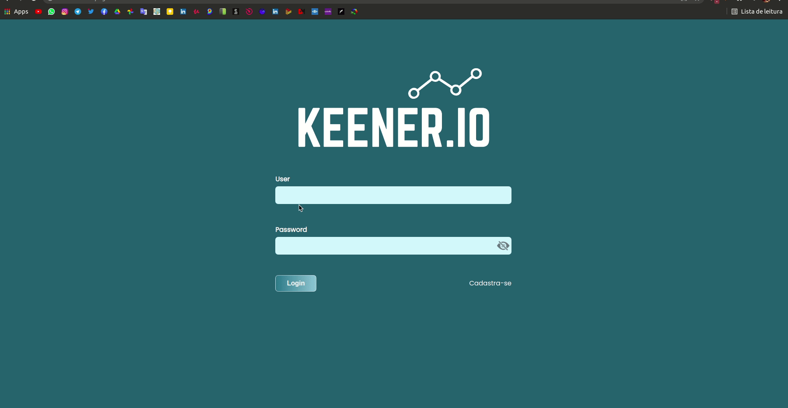

<h1 align="center"> KEENER </h1>

#

<h2 align="center">Tecnologias Usadas</h2>

 

 

 

#

 
- aplicação desenvolvida para o processo seletivo da Keener Innovations

#

### **Rode na sua maquina**
 - Crie um banco destinado para a aplicação
- - As tabelas e triggers serão gerados automaticamente
- O arquivo **.env.example** dentro de server renomeie para **.env**
- - Logo em seguida siga as instruções contidas nele.
- Na pasta **client** rode um yarn install
- - Vai instalar as dependências do frontend
- Na pasta **server** rode um yarn install
- - Vai instalar as dependências do backend

* Agora com tudo pronto rode o comando **_'yarn run dev'_**  na pasta **_'server'_**
- - Se tudo ocorreu bem, basta acessar [http:localhost:300/](http:localhost:300/) no seu browser

